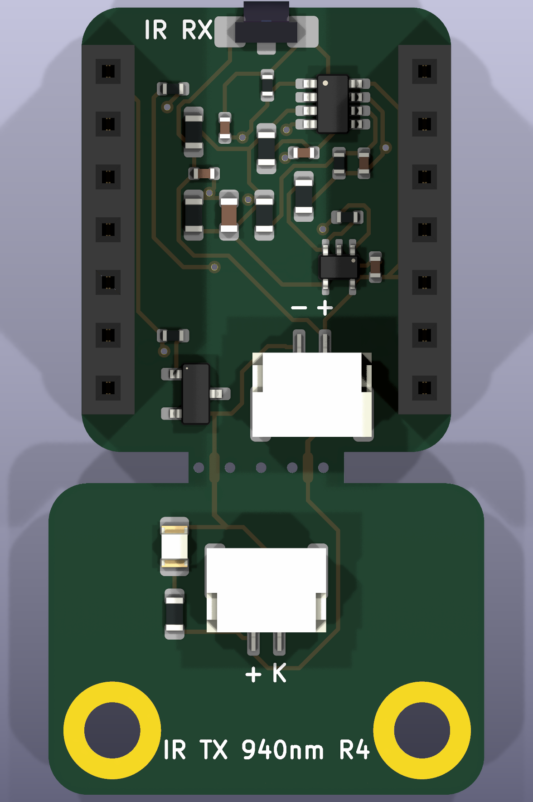

# IR Spoke Sensor

[](https://github.com/niklasdathe/IRBicycleWheelSpeedSensor/actions/workflows/repository-checks.yml)
[](https://niklasdathe.github.io/IRBicycleWheelSpeedSensor/)

Configurable 940 nm through-beam spoke sensor for a Seeed Studio XIAO
ESP32-S3. A discrete analog front end restores a 25-50 kHz optical carrier;
ESP-IDF RMT detects its interruption and learns the wheel's spoke pattern.

This repository is the wheel-speed-sensor subsystem of
[BicycleOBU](https://github.com/niklasdathe/BicycleOBU). The
[online Interactive BOM](https://niklasdathe.github.io/IRBicycleWheelSpeedSensor/)
is generated directly from the authoritative KiCad PCB.



## Status

**R4 engineering prototype — electrically simulated and fabrication checks
pass; physical validation is still open.**

| Area | Current evidence |
|---|---|
| Hardware | KiCad 10 ERC: 0 errors, 3 known library-sync warnings; DRC: 0 violations, 0 unconnected pads |
| Connectivity | 70 schematic endpoints, PCB pad nets and SPICE topology cross-checked |
| Simulation | Python transient, 10,000-case sweep and ngspice cross-check pass |
| Firmware | Portable C modules and ESP-IDF adapters implemented; target build/HIL pending |
| Manufacturing | Versioned JLC Gerber/BOM/CPL package generated; assembly-preview approval pending |
| Physical performance | Sunlight, alignment, contamination, vibration and power tests pending |

Do not treat simulation as production validation. The remaining gates are
listed in [TODO.md](TODO.md).

## Start here

| Goal | Guide |
|---|---|
| Understand the signal chain | [System overview](docs/system_overview.md) |
| Open the design or run the simulator | [Getting started](docs/getting_started.md) |
| Change configuration, firmware or captured CAD | [Development workflow](docs/development.md) |
| Order or review the PCB | [Manufacturing](docs/manufacturing.md) |
| Inspect or place components | [Interactive BOM](docs/interactive_bom.html) |
| Bring up and correlate a prototype | [Bring-up and test](docs/bringup.md) |
| Trace a requirement to evidence | [Verification matrix](requirements/verification_matrix.md) |
| Find a technical reference | [Documentation index](docs/README.md) |

## Design at a glance

| Property | R4 value |
|---|---|
| Optical path | 940 nm VSMB1940X01 emitter to VEMD10940FX01 photodiode |
| Carrier | 25-50 kHz runtime range; 38 kHz default; 50% duty |
| Receiver | TLV9062 TIA/band-pass, TLV7011 Schmitt comparator |
| MCU interface | GPIO1 RMT TX, GPIO2 RMT RX with carrier demodulation |
| Wheel design range | 16-48 spokes; 60 km/h requirement, 80 km/h stress calculation |
| Receiver outline | 17.8 x 21.4 mm XIAO outline |
| Emitter outline | 21 x 15 mm, two M2.5 holes |
| Panel | Two-layer PCB with one routed mouse-bite breakaway tab |
| Remote link | 600 mm two-conductor JST-GH harness after snap-off |
| Optional interface | Official XIAO MCP2515 CAN expansion; disabled by default |

## One-command entry points

```powershell
.\Open-IR-Spoke-Sensor.cmd
.\Open-Interactive-BOM.cmd
py -3.14 simulation\local_server.py
powershell -ExecutionPolicy Bypass -File tests\run_all.ps1
powershell -ExecutionPolicy Bypass -File hardware\export_jlc.ps1 -Revision R4
```

The KiCad launcher also starts the InteractiveHtmlBom watcher at
`http://127.0.0.1:8766/`; every complete PCB save regenerates and reloads the
browser view. The simulator opens at `http://127.0.0.1:8765/`. Disposable
simulation evidence is written under ignored `build/`.

## Source of truth

| Concern | Authoritative source |
|---|---|
| Tunable system values | [`config/system.json`](config/system.json) |
| Pins and electrical nets | [`hardware/connectivity.json`](hardware/connectivity.json) |
| Parts, fields and procurement | [`hardware/component_catalog.json`](hardware/component_catalog.json) |
| Captured schematic and routing | [`hardware/ir_spoke_link/layout_manifest.json`](hardware/ir_spoke_link/layout_manifest.json) |
| Requirements | [`requirements/requirements.yaml`](requirements/requirements.yaml) |
| Project paths and revision | [`project_manifest.json`](project_manifest.json) |

Generators restore the captured user layout and must not synthesize, remove or
reroute tracks. See [CONTRIBUTING.md](CONTRIBUTING.md) before changing CAD or
generated files.

## License

No project license has been selected yet. Until one is added, the repository
must not be presented as granting open-hardware, software or documentation
reuse rights.
