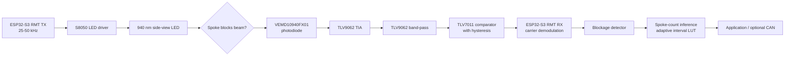

# System overview

## Purpose

The sensor measures spoke passages by shining a modulated infrared beam across
the wheel. A spoke briefly blocks the beam. The receiver converts the missing
carrier interval into a timestamped digital event for an ESP32-S3.

This is carrier-presence sensing, not an IR data protocol.

## Signal chain

The main board and emitter are initially one routed panel. After functional
test, the emitter snaps off and reconnects through the two-conductor JST-GH
harness.

## Modulation

RMT TX drives the LED with a 50% duty square carrier. With a clear beam, the
photodiode and analog front end recover that periodic energy and the comparator
produces logic edges. A spoke removes several carrier cycles. RMT RX
demodulation converts that carrier loss into a single interval for the
detector.

Modulation improves reliability because:

- the AC-coupled band-pass rejects DC and slowly changing ambient light;
- energy in a known frequency range is easier to distinguish from broadband
  noise than unmodulated intensity;
- comparator hysteresis suppresses repeated transitions near threshold;
- RMT filters and demodulates in hardware, so the application processes
  blockage intervals instead of every carrier edge.

The photodiode includes a daylight-blocking optical filter, but sunlight still
contains 940 nm energy. Modulation reduces ambient sensitivity; it does not
remove the need for physical sunlight testing.

## Timing and adaptation

The configured design range is 16-48 spokes at up to 60 km/h, with an 80 km/h
stress calculation. The detector accepts only blockage widths inside the
configured interval. Accepted timestamps feed a portable pattern module that:

1. rejects outliers;
2. estimates the repeating spoke count;
3. maintains one expected interval per spoke in a bounded LUT;
4. updates the LUT continuously with exponential adaptation.

Uniformly spaced spokes do not contain enough information to identify an
absolute spoke index. The implementation reports confidence and keeps adapting
instead of requiring a manual calibration.

## Model boundary

The executable models include wheel geometry, optical coupling, photodiode
current/capacitance, analog bandwidth and noise, comparator behavior, RMT
timing, power transients and optional CAN load. Python supplies the interactive
and tolerance model; ngspice cross-checks the electrical transient.

They do not prove real beam alignment, lens/fixture tolerances, spectral
sunlight rejection, water/dirt behavior, cable vibration or component aging.
Those are explicit prototype tests in [Bring-up and test](bringup.md).

## Interfaces

| Boundary | Contract |
|---|---|
| Tunable model to generated code | `config/system.json` |
| Schematic/PCB to SPICE | `hardware/connectivity.json` |
| Comparator to MCU | GPIO2, RMT RX symbols |
| Detector to pattern learner | accepted event timestamp and blockage width |
| Pattern learner to application | count, confidence, phase and interval LUT |
| Application to CAN adapter | transport-independent fixed telemetry frame |

Detailed interfaces are in
[`firmware/components/ir_spoke_core`](../firmware/components/ir_spoke_core/)
and [Executable relationships](model_relationships.md).
